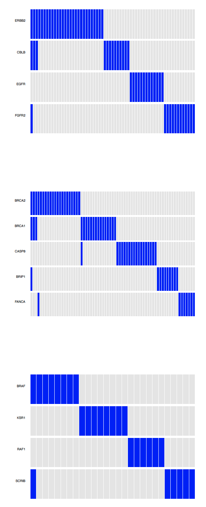

# gcMECM: Graphical Clustering of Mutual Exclusivity of Cancer Mutations 

The package combines graph clustering, mutation association, and gene interaction 
by the mutually exclusively mutated gene sub-networks **to identify sub-networks with distinct biological functions from 
pathways**. The sub-networks reveal 
crucial genes in the canonical pathway and discover new cancer-relevant genes and relative biological 
functions, which could used to build better prediction models of clinical response and survival. 
gcMECM also provides informative visualization functionality of mutual exclusivity and network.

# Introduction

### Mutation and pathway data
The mis-sense mutation and clinical outcome datasets for BRCA (Breast invasive carcinoma) in The Cancer Genome Atlas (TCGA) were obtained from [The NCI Genomic Data Commons (GDC, version 6)](https://portal.gdc.cancer.gov). RAS pathway v2.0 is obtained from [NCI Ras Initiative](https://www.cancer.gov/research/key-initiatives/ras/ras-central/blog/2015/ras-pathway-v2). The pathway structure and gene coordinates were created manually for the visualization. KEGG pathway images and gene relationships were from [KEGG database](https://www.genome.jp/kegg/pathway.html).

### Detection of modules with mutually exclusive mutations 
#### Step 1
Generate the pairwise gene-gene adjacency distance matrix from the p-value of one-tailed Fisher’s exact test and generalized linear models (glm). Select gene pairs with smaller p-values and negative correlation in glm. The Fisher’s exact test p values are used as the distance in the matrix.
#### Step 2
Convert the distance matrix into a weighted graph or network using R package igraph. The resulting graph was clustered into modules with the Louvain algorithm. 
#### Step 3
Overlay the modules onto the canonical pathways.

# Tutorial and examples
### Installation
``` r
library(devtools)
remotes::install_github("CBIIT-CGR/gcMECM")
``` 
  
### Cluster using Fisher's p values
```r
library(gcMECM)

## load the output of Fisher's test
dat    <- read.table(gzfile(infile), header=T);

## convert the p values to distance matrix
dat.d  <- p2dist(dat.s[,c(gene.i,gene.j)], as.numeric(dat.s[,pvalue.l]));

## cluster from the distance matrix 
clu    <- dist2cluster(dat.d, wt=wt, method="louvain");
```
Download the exmaple codes ([02p2cluster.R](examples/02p2cluster.R))
### Mapping clusters on the pathways
```r

library(gcMECM);
## load the pathway data
library(NCIRASPathway);

## get genes of the pathway
g.xy  <- get_node_layout();

## load gene relationships of the pathway
pdat  <- get_relations()

## read cluster data from dist2cluster
clu.d  <- read.table(gzfile(infile), header=T);
```
Download the example codes ([R codes](examples/03cluster_map.R)) by NCI RAS pathway in [NCIRASPathway](https://github.com/CBIIT-CGR/NCIRASPathway) package. The output figures are as the follows (three sub-networks in the pathway and plots).

  
  
The option example codes ([R codes](examples/05kegg_pathway.R)) were for Ras signaling pathway of KEGG with [OmicPath](https://github.com/CBIIT-CGR/OmicPath) package. The output figures are as the follows (two sub-networks in the pathway and plots).

  

# Advanced (optional) steps
### Mutually exclusive mutation plots
For partial model ([R codes](examples/04_1plot_ME.R)) and sub-networks ([R codes](examples/04_2plot_ME.R))

  


test
